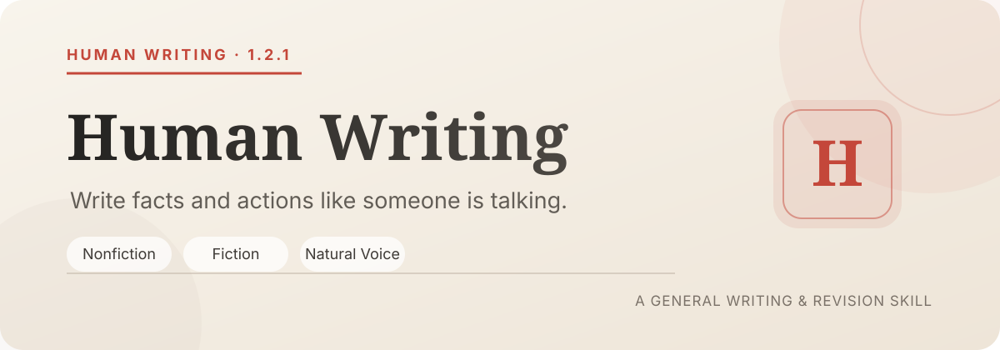

<p align="center">
  
</p>

<p align="center">
  <a href="https://github.com/Artlands/human-writing/releases/tag/v1.2.1"></a>
  <a href="./LICENSE"></a>
  <a href="https://github.com/Artlands/human-writing/releases/latest"></a>
</p>

<p align="center">
  <a href="#quick-installation">Quick Installation</a> ·
  <a href="#what-it-does">Writing Process</a> ·
  <a href="#repository-structure">Repository Structure</a> ·
  <a href="https://github.com/Artlands/human-writing/issues">Submit Issues</a>
</p>

> AI-written prose often reads smoothly, but you can't tell who wrote it. Human Writing aims to fix this.

Make model-generated articles read like a real person talking—someone with knowledge, judgment, who occasionally goes off on a tangent but can get back on track. Applicable to answers, articles, scientific papers and proposals, blogs, forum posts, character stories, popular science, reviews, novels, oral presentations, and more.

## What It Does

Before writing, solve one prerequisite: do you have something to write about?

For realistic content, if materials are insufficient, research them. If you can't find them, ask follow-up questions or shorten the piece—never use empty repetition to pad word count. For fictional content, you can freely create characters and plots, but each scene still needs a goal, action, and change.

After materials are verified, manage three things:

| Materials | Progression | Voice |
| :--- | :--- | :--- |
| Realistic writing verifies facts, numbers, quotes, and personal experience. Fictional writing checks characters, actions, and causality. | Each paragraph must bring something new—new facts, new actions, new examples, or new consequences. Don't repeat what's been said. | Keep natural language as the foundation, mind word order and pauses, and remove report tone, model tone, and reversal sentences. |

There's one more gate after the first draft. The Skill checks each paragraph for spinning in place, cuts redundant explanations, adjusts the rhythm of long and short sentences, and blocks overuse of colons, dashes, reversal tones like "not...but...," and common AI jargon. The check script only manages hard rules already documented, not your style choices.

## Quick Installation

Send this command to your Agent:

```bash
Help me install this skill: https://github.com/Artlands/human-writing
```

The Agent will read the repository, find `human-writing`, and complete installation. After installation, it will display as "Human Writing."

<details>
<summary><strong>When Agent doesn't support direct installation</strong></summary>

Download from [Releases](https://github.com/Artlands/human-writing/releases/latest), or copy the [`human-writing`](./human-writing) folder from the repository to your local Skills directory. Keep the folder name as `human-writing`.

```text
~/.agents/skills/human-writing/
```

</details>

After installation, use it like this:

```text
Use $human-writing to write my materials into a piece with human presence and natural rhythm.
```

## What Changed in 1.2.1

Added comprehensive scientific-writing support for research papers, abstracts, literature reviews, research and grant proposals, and technical reports. The evidence-first guide includes embedded PRISMA, NIH, and NSF requirements, an NSF Project Summary example, citation and research-integrity safeguards, and templates for core scientific sections and peer-review responses.

## What Changed in 1.2.0

Human Writing is now fully available in English and uses language-neutral positioning throughout the documentation, configuration, and lite guide. The skill continues to support nonfiction and fiction across common writing formats without being tied to a specific language.

## What Changed in 1.1.0

Version 1.0 used string-level prohibitions to block AI tone—forbidding "not...but...," colons, and a batch of jargon. Effective, but models would just use different wording for the same technique. "You thought...actually...," "didn't realize until later," and "not A but B" are the same move—readers recognize the move, not the words.

Version 1.1 shifts the defense from words to actions: it prohibits the act itself of "first creating a misunderstanding the reader doesn't have, then refuting it," regardless of disguise. The detection script upgraded accordingly, adding warning layers for reversal-tone variants, AI parallelism, poetic metaphors, plus statistical checks for sentence-length variation and conjunction density. It also rescued ordinary expressions like "not shameful" and "tactics" from the false-positive list. Additionally, a 2000-character distilled version is available for direct pasting into chat windows.

See [CHANGELOG.md](./CHANGELOG.md) for the complete changes.

## Repository Structure

<details>
<summary><strong>Expand to see complete directory</strong></summary>

```text
human-writing/
├── SKILL.md
├── VERSION
├── LICENSE
├── agents/
│   └── openai.yaml
├── dist/
│   └── human-writing-lite.md
├── references/
│   ├── forum-prose.md
│   ├── reality.md
│   ├── fiction.md
│   ├── formats.md
│   ├── scientific-writing.md
│   └── revision.md
└── scripts/
    └── check_prose.py
```

| Location | Purpose |
| :--- | :--- |
| [`SKILL.md`](./human-writing/SKILL.md) | Entrance. Contains material threshold, real vs. fiction routing, writing process, and delivery prohibitions |
| [`forum-prose.md`](./human-writing/references/forum-prose.md) | How to write Zhihu answers, WeChat articles, and forum long posts—specific techniques for rhythm and wording |
| [`reality.md`](./human-writing/references/reality.md) | Fact boundaries for real people, history, news, data, and personal experience |
| [`fiction.md`](./human-writing/references/fiction.md) | Creation rules for novels, stories, fictional prose, and dialogue |
| [`formats.md`](./human-writing/references/formats.md) | Special formats like short content, oral presentations, speeches, tutorials, reviews |
| [`scientific-writing.md`](./human-writing/references/scientific-writing.md) | Evidence-first guidance for papers, literature reviews, proposals, and technical reports |
| [`revision.md`](./human-writing/references/revision.md) | How to revise after the first draft—pass-by-pass checklist |
| [`check_prose.py`](./human-writing/scripts/check_prose.py) | Check if the final draft hits any hard prohibitions |
| [`human-writing-lite.md`](./human-writing/dist/human-writing-lite.md) | Distilled version under 2000 characters, paste directly into chat windows |

</details>

## Feedback

Open source under MIT license. The repository contains only original rules and tools, no third-party articles, training data, or model weights.

If you encounter rule conflicts, false positives, or inconsistent behavior with certain models, please [file an Issue](https://github.com/Artlands/human-writing/issues). Include your prompt, model output sample, and what you think it should be—this speeds up troubleshooting significantly.

<p align="center">
  <sub>Human Writing · 1.2.1</sub>
</p>
